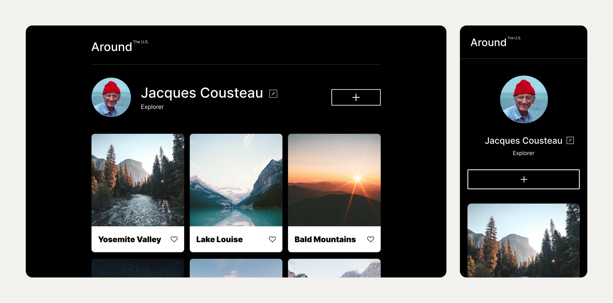

# Project Name: Around the U.S.

This project is a dynamic web application created using CSS and HTML, allowing users to share their photography journey with the world. Similar to other social media applications, users can create profiles, upload photos, and add descriptions, connecting with like-minded individuals who share their passion for photography.

**Project Creation Walkthrough Video**

- [Link to video](https://www.loom.com/share/ffd98628be6f4945883adf0597c86162?sid=003f5327-5ca7-4065-87be-4056e3b61184)

## Technologies Used

- CSS for styling and layout design.
- HTML for structuring the webpages.
- Flexbox and Grid Layout for responsive and adaptive website design.
- BEM Methodology for maintainable and scalable CSS architecture.
- Design reviewed using Figma for user interface and experience enhancements.
- Integration of images for visual content enhancement.

## Plan on improving the project

**Integration with Backend Services:** Integration with back-end services such as a database or booking system.

**Feedback Collection:** Implement mechanisms for collecting user feedback to gather insights into user preferences, pain points, and areas for improvement.

**Enhanced Visual Design:** Refine visual design of the webpage to create a more immersive and captivating experience for users.

**Figma**

- [Link to the project on Figma](https://www.figma.com/file/ii4xxsJ0ghevUOcssTlHZv/Sprint-3%3A-Around-the-US?node-id=0%3A1)

[def]: /images/img.jpg
[def2]: ./images/Image.png
